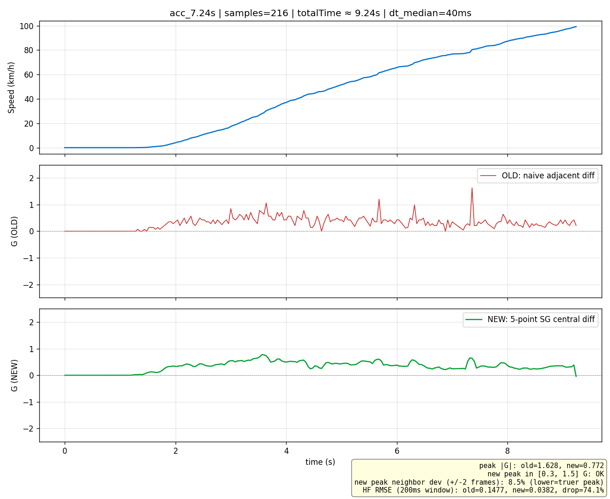
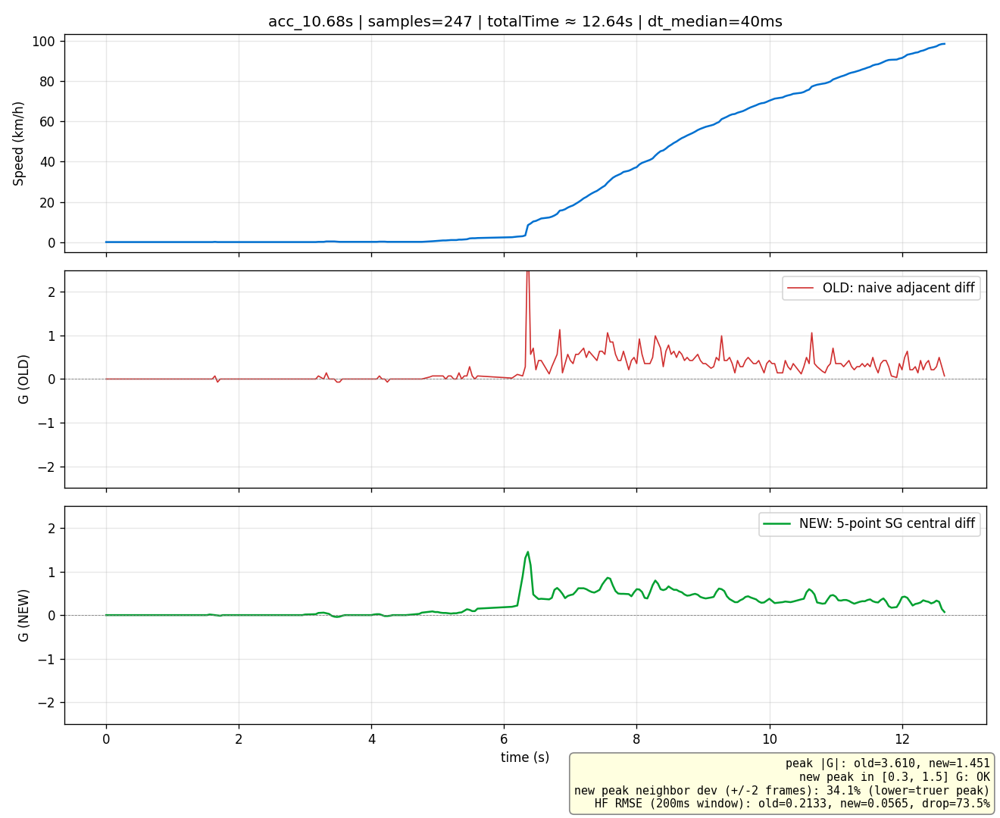
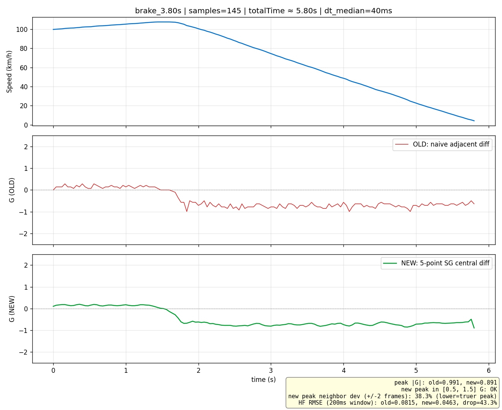

## Context

性能测试（0-100 加速、100-0 制动）的结果详情页有两条曲线卡：速度曲线（`SpeedChart`）+ G 值曲线（`GForceChart`）。用户实测 10.2s 与 7.2s 两条 0-100 记录后反映：G 值曲线**满屏高频尖刺**，maxAcceleration 数字看上去不可信。

**当前加速度算法散落在三处，全是相邻两帧一阶差分**：

| 位置 | 用途 | 公式 | 输入速度源 |
|---|---|---|---|
| `core/domain/.../GpsDataFilter.kt:149-159` | 实时（trigger 判定 + ViewModel live G） | `dv = (curr − prev) / 3.6; a = dv / dt` | `previousRaw.speed`（**raw**，未经 9 点 median） |
| `core/domain/.../CalculateResultUseCase.kt:162-179` | 测试结束后算 `maxAcceleration` / `avgAcceleration` | 同上 + `Math.abs() / 9.81` + `if (accel < 3.0) keep` | `dataPoints[i].speed`（filteredData.speed → 已 9 点 median） |
| `feature/test/.../SpeedChart.kt:175-196` | UI G 值曲线渲染 | 同上 + `if (abs(gForce) >= 3.0) drop` | 同上 |

**数据采样约束**（A56 binary 落盘后）：
- 采样率 25 Hz → dt = 40 ms
- 速度量化 0.1 km/h（`speedKmh × 10` 取整存 u16）→ 量化下限加速度 = 0.1/3.6/0.04/9.81 ≈ **0.07 G/帧**
- 真实 G 值物理带宽（驾驶员脚踩 + 悬挂 + ABS 响应）≈ 5 Hz
- 单次 0-100 测试约 100-150 点；100-0 制动约 80-100 点

**已有平滑层**：`GpsDataFilter` 已在内部维护 9 点 median 速度窗 → 输出 `outputSpeed`。但 `calculateAcceleration` 内部用 `previousRaw.speed`（raw），导致**输出 speed 是平滑过的、内部 acceleration 用 raw**的内部数据源不一致。

## Goals / Non-Goals

**Goals**：

- 性能测试结果曲线的 G 值无肉眼可见高频尖刺（量化标准：合成"匀加速 + 高频小噪声"输入下加速度 RMSE 降幅 ≥ 70%）
- 三处加速度计算合一为单一函数 `AccelerationSmoother`，UI 与离线统计相同输入下产出**相同曲线**
- `GpsDataFilter` 内部数据源一致（acceleration 与 outputSpeed 同源）
- `maxAcceleration` / `maxDeceleration` 字段拆分，加速测试与制动测试的极值统计语义清晰
- UI 在边界值（≥3G）处不再出现折线 V 字断点
- 用默认真机存量 binary 数据完成"旧 vs 新"算法 baseline 对比，作为本 round 的可论证证据

**Non-Goals**：

- ❌ 不引入 IMU / 手机加速度计 / 陀螺仪 / 任意 sensor fusion（探索阶段已显式拒绝，留给未来 round）
- ❌ 不引入 1D Kalman / 二阶 Butterworth 等高级算法（先验证 SG 落地效果再决定是否升级）
- ❌ 不改 RaceChrono BLE 协议（公共协议边界）
- ❌ 不改 binary telemetry 文件格式（17-byte sample schema 保持，仅消费）
- ❌ 不改 `GpsDataFilter` 的 9 点 median windowSize / 物理约束阈值（baseline 不动）
- ❌ 不动 `dataPoints` 持久化方案（属于 `speed-curve-real-data-persistence-deferred.md` 主题）
- ❌ 不动 lap timing 通道滤波接入（属于 `laptime-gps-filter-integration-deferred.md` 主题）
- ❌ 不重算存量记录的 `maxAcceleration` 历史值（含旧 abs 污染，本 round 不修复存量，避免 scope 蔓延到"binary 回放重算"）
- ❌ 实时路径（`GpsDataFilter.calculateAcceleration`）不上 SG（理由见 D2）

## Decisions

### D1：算法选 5 点 Savitzky-Golay 中心差分

**替代方案**：3 点 SG（≡ 普通一阶差分）/ 7 点 SG / EMA / 1D Kalman / 二阶 Butterworth IIR。

**选 5 点 SG 的理由**：

| 维度 | 5 点 SG | 3 点 SG | 7 点 SG | EMA | Kalman | Butterworth |
|---|---|---|---|---|---|---|
| 时间窗（25Hz） | 200ms ✅ | 120ms（不够压量化噪声） | 280ms（过度平滑刹车瞬间） | 不定 | 不定 | 不定 |
| SNR 改善（理论） | √5 ≈ 2.2× | √3 ≈ 1.7× | √7 ≈ 2.6× | 取决于 α | 高但需调参 | 高但有 ringing |
| 相位延迟 | 0（中心差分） | 0 | 0 | 1/(1-α) 帧 | 0 | 1-2 帧 |
| 调参 | 无（系数固定） | 无 | 无 | α | Q/R 矩阵 | 截止 + 阶数 |
| 单测可固定 | ✅ 系数表 | ✅ | ✅ | ⚠️ α 需要决策 | ❌ 调参 | ⚠️ 截止需要决策 |
| 真实加速度峰值损失 | 估计 < 5%（200ms 远小于 0-100 加速段 4-6s） | 极低 | 估计 8-15%（接近刹车上升时间） | 取决于 α | 取决于 Q | 取决于截止 |

**5 点 SG 一阶导数中心系数（已知教科书）**：`[-2, -1, 0, 1, 2] / (10 · dt)`，即：

```
a[i] = (−2·v[i−2] − v[i−1] + 0·v[i] + v[i+1] + 2·v[i+2]) / (10 · dt)
```

边界处理用教科书 forward / backward 5 点系数（i = 0, 1, N−2, N−1 各一组），保留 5 阶精度而非简化退化为 3 点。

**等间距假设与 `correctTimingPoints` 顺序的 hidden hazard**：5 点 SG 系数推导基于均匀采样多项式拟合，**严格要求等间距**。`CalculateResultUseCase.invoke` 当前流程是「`correctTimingPoints` 注入 preciseStart / preciseEnd 锚点 → `calculateAccelerations(correctedPoints)`」，corrected 序列首尾两帧的 dt 与采样标称 40ms **不相等**（取决于真实数据点何时跨过阈值）；如果直接对该序列套 5 点 SG 系数，i=0 / i=1 / i=N-2 / i=N-1 这些极值出现高发位置会被算坏。

**实施约束**（spec.md Requirement 1 已锁定）：

1. `calculateAccelerations(rawDataPoints)` MUST 在 `correctTimingPoints` **之前**执行，吃未注入锚点的原始等间距序列
2. `compute()` 内部检查每帧 dt 偏差 < 20%（相对 dt_median）；超过则整段退化到 3 点 SG（系数 `[-1, 0, 1] / (2 · dt_local)`）
3. 退化路径在 spec scenario 反例中锁死："非均匀 dt 不允许直接套 5 点 SG 中心系数"

注：3 点 SG ≡ 一阶差分（数学等价），意味着退化路径**本身不平滑**，仅作为"非均匀 dt 兜底"避免 5 点 SG 系数失真。如果非均匀 dt 是常态（不应该是），需立项更稳的非均匀 SG 实现（局部最小二乘拟合二次多项式取导）。

### D2：实时路径不上 SG，仅修速度源

**替代方案**：实时路径也上 SG（用历史 4 个点 + 当前点的 backward 系数）。

**选当前方案理由**：

- SG 中心差分需要 ±2 邻居 → 等同 80ms 延迟
- 用 backward 5 点系数避免延迟，但 backward 系数 SNR 改善 < 中心差分
- 实时加速度的真正消费方：
  - `TestSessionViewModel.checkAccelerationTrigger` / `checkBrakingTrigger` —— 阈值粗糙（±0.1G 量级），不在乎尖刺
  - ViewModel UI live G 数字 —— 数字跳动，不画曲线，体感即可
- 用户真正在意的"曲线尖刺"完全在离线路径
- 修速度源（raw → outputSpeed）成本 1 行，能让 9 点 median 隐式平滑被传递到 acceleration —— 已经能把实时尖刺压到大致 0.1-0.2G 量级
- 真要进一步压实时尖刺，未来加 EMA(α=0.3) on acc 是 10 行的事，本 round 不做

**`previousOutputSpeed` 缓存与既有 `isAnomaly` 状态机的 invariants**（spec.md Requirement 3 已锁定）：

baseline `fix-gps-data-filter-signal-loss-and-anomaly-hygiene` round 锁定了三条与 acceleration 相关的状态机规则（A12 / A13 / A14）：

- **A12**：`dt > 200ms` 时 `previousRaw / previousPosition` 重置为 null（信号丢失重连兜底）
- **A13**：异常帧（`isAnomaly == true` 或 `isPositionAnomaly == true`）MUST NOT 更新 `previousRaw / previousPosition`（保持基准锁在最近的非异常帧）
- **A14**：异常帧 MUST NOT 进入 `speedWindow / latWindow / lonWindow`（避免污染 median）

新增字段 `previousOutputSpeed: Double?` MUST 与以上三条规则**对称扩展**：

| 状态机事件 | previousOutputSpeed 行为 | 理由 |
|---|---|---|
| `dt > 200ms` 触发 A12 重置 | 同时置 null | 与 previousRaw 同生命周期，避免跨断点 dv 失真 |
| 本帧 isAnomaly == true | MUST NOT 更新 | 与 A13 对称，保持基准锁在最近非异常帧 |
| 本帧 isPositionAnomaly == true | MUST NOT 更新 | 同上 |
| `speedWindow.size < 3` warmup 期 | outputSpeed 退化为 raw.speed，自然存入 previousOutputSpeed | warmup 内 trigger 不强求平滑 |
| `reset()` 显式调用 | 同步清空 | 避免内存残留 |

未对称扩展的风险：连续异常帧期间，正常帧 acceleration 计算 dt 会跨越异常帧时段（数百 ms），加速度估值畸大。spec.md 新增反例 scenario 锁死该交互。

### D3：`maxAcceleration` / `maxDeceleration` 拆字段，**BREAKING**

**当前 bug**：`CalculateResultUseCase.kt:171` `Math.abs(dv/dt)` 让刹车 −1.2G 也按 +1.2G 计入，maxAcceleration 在 100-0 制动测试里实际上是"最大制动 G"。

**替代方案**：

- 选 a：保留单字段 `maxAcceleration`，去 abs，存正/负 G 极值（abs 大者）→ 失语义，UI 看不出加速还是制动
- 选 b：保留 abs，新增 `maxDeceleration` 字段 → bug 没修，统计混乱

**选当前方案（拆分 + 去 abs）理由**：

- `maxAcceleration` 严格语义为"正向最大 G"（dv/dt > 0 区间内最大）
- `maxDeceleration` 严格语义为"负向最大 G 的绝对值"（dv/dt < 0 区间内 |min|）
- 0-100 加速测试：`maxAcceleration > 0`, `maxDeceleration = 0.0`
- 100-0 制动测试：`maxAcceleration = 0.0`, `maxDeceleration > 0`
- UI 渲染：按测试模板二选一显示，0.0 视为"未填充"降级

**Room migration 策略（debug 阶段决策，2026-05-03 调整）**：

不写 strict migration（v4 → v5 不提供 `ALTER TABLE` 函数），改用 `fallbackToDestructiveMigrationFrom(4)` 让 Room 在装新包时**重建 test_records 表**（数据清空）。AppModule.kt:

```kotlin
.addMigrations(AppDatabase.migration3To4)  // v3→v4 既有 strict 不动
.fallbackToDestructiveMigrationFrom(1, 2, 4)  // v1/v2 兜底（pre-A56 开发期）+ v4 本 round destructive
```

**采纳理由**：

- 本工程当前在 debug 期，存量 V1 测试记录可接受清空（user 多个并行 round 都按此策略）
- v3→v4 既有 strict migration（persist-session-summary-fields round 落地）保留不动，避免破坏现役升级路径
- 仅本 round 引入的 v4→v5 走 destructive，scope 局限
- 单测层面对应：`AppDatabaseMigrationSqlTest` 不新增 v4→v5 SQL 断言（无 SQL 可验）

**上线前 follow-up（必须补）**：补回严格 migration 函数 + 单测，参照 v3→v4 既有 `migration3To4` / `migration3To4Sql` pattern；同时把 `fallbackToDestructiveMigrationFrom(1, 2, 4)` 收回为 `(1, 2)`。这条 follow-up 登记在 tasks §8 backlog（命名建议 `restore-strict-migrations-pre-release`）。

**字段类型**：`maxDeceleration: Double = 0.0` —— Kotlin 默认值 0.0 让 Room 重建表时新字段直接为 0.0（destructive 路径下表是空的，无所谓默认值；非 destructive 路径下未实施，留给 follow-up）。

### D4：UI 边界 clip 而非 drop

**当前**：`GForceChart.kt:191` `if (abs(gForce) >= 3.0) return null`，UI 折线被相邻有效点直连为**长直线**穿过尖刺位置 → 视觉上反而更刺眼。

**改造**：把超 ±3G 的点 `coerceIn(-3.0, 3.0)` 而非 drop，曲线在边界处呈水平段，明显是"超出显示范围"的视觉信号。

实际上 SG 平滑后单点超过 3G 的情况会大幅减少（除非真的记录到极限制动），但 clip 是兜底防护。

### D5：取证走 `adb run-as` 而非加 app 内 dev tool

**替代方案**：在 app 加 debug-only Composable 入口，选记录 → 解码 → 导出 csv 到 Downloads。

**选当前方案理由**：

- dev 入口需要 UI / build flavor / 后续清理，scope 蔓延
- `adb shell run-as <pkg>` 对 debug 包直接可用，零代码改动
- 取证脚本是一次性 Python，不进 codebase（产出 = design.md §2 内的对比图）
- 默认真机 `8KE0219522008434` 当前装的是 develop debug 包（待 task 0.1 验证）

**风险兜底**：若真机装的是 release 包，临时 build & install debug 包跑两次新测试补样本；存量记录则放弃，靠新数据。

## Risks / Trade-offs

- **[SG 5 点对真实强加速峰值的削峰]** → 200ms 窗口远小于典型 0-100 加速段 4-6s 上升时间；100-0 制动从 0.5G 爬到 1.2G 通常需要 100-200ms，5 点 SG 在转折点会有 ~3-5% 峰值损失。**Mitigation**：用真机存量 binary 数据验证新算法峰值落物理合理区间（见「数据证据」附录），且峰值邻居偏差 < 30% 表明峰值非孤立 spike；如某条记录峰值落区间外或邻居偏差远超阈值，**回退方向是升级而非降级**：(a) **升级到 7 点 SG**（系数 `[-3, -2, -1, 0, 1, 2, 3] / (28 · dt)`，时间窗 280ms，接受 ~8% 真实峰值损失换取更强 SNR）或 (b) **EMA(α=0.3) 后置平滑** on SG 5 点输出。**MUST NOT 退到 3 点 SG**——3 点 SG 系数 `[-1, 0, 1]/(2·dt)` 数学等价于普通一阶差分，对压抑高频噪声无作用，等于本 round 不做。注意 MUST NOT 用 "新峰值 / 旧峰值 ≥ X%" 这种反向指标——旧算法峰值通常是噪声 spike，新算法压低恰好是成功证据。
- **[5 点 SG 边界处理引入误差]** → 前 2 点 / 后 2 点用 forward/backward 系数，理论上 SNR 改善略低于中心差分，但仍优于一阶差分。**Mitigation**：单测专门覆盖边界帧 RMSE。
- **[Room migration 失败破坏存量记录]** → migration 仅 ADD COLUMN DEFAULT 0.0，向前兼容。**Mitigation**：测试用旧 schema db 文件做 migration 单测；准备回滚 sql。
- **[`maxAcceleration` 字段语义改变破坏 UI]** → 字段名相同但值范围语义收紧。**Mitigation**：grep 全部消费点（已识别 `PerformanceResultScreen.kt:115` `record.maxAcceleration` 传给 `GForceCurveCard`），逐个跟随改造；写改造前后对比表入 tasks.md。
- **[存量记录 `maxAcceleration` 含旧 abs 污染]** → 100-0 测试存量记录该字段实际是制动 G，UI 显示语义错位。**Mitigation**：本 round 不重算存量，接受历史不可信；后续如有需要可单独立项 `recompute-historical-perftest-stats`。
- **[`adb run-as` 在 release 包失败]** → debug 包默认可用。**Mitigation**：task 0.1 先验证当前真机包类型，失败则装 debug 补两次新测试。

## Migration Plan

**阶段 1：取证（不动产线代码）** —— task 0.x

1. `adb -s 8KE0219522008434 shell run-as <pkg> ls files/telemetry/` 列 binary 文件
2. `adb shell run-as <pkg> sqlite3 databases/<db> "SELECT id, totalTime, dataFilePath FROM test_records ORDER BY timestamp DESC"` 找 10.2s / 7.2s 对应 sessionId
3. `adb shell run-as <pkg> cat files/telemetry/<id>.bin > <local>.bin` 拉到 PC
4. Python 脚本（一次性，不进 codebase）按 `GpsBinaryFormat` 解码 → CSV
5. 离线跑旧算法（一阶差分）+ 新算法（5 点 SG）→ matplotlib 对比图
6. 截图入 `design.md` §「数据证据」附录

**阶段 2：实现** —— task 1.x ~ 5.x

7. 新建 `AccelerationSmoother`（纯函数，独立于其它领域类型）+ 完整单测覆盖
8. `CalculateResultUseCase` 改用 smoother，统计字段拆分
9. `GForceChart` 改用 smoother + clip
10. `GpsDataFilter.calculateAcceleration` 速度源切换（1 行）
11. `TestRecordEntity` Room schema migration + repository 改造
12. UI 渲染（`PerformanceResultScreen` 等）适配新字段

**阶段 3：真机验证** —— task 6.x

13. 装新包到 `8KE0219522008434`，跑 2 次 0-100 + 2 次 100-0
14. 截图新 G 值曲线确认肉眼无高频尖刺
15. 对比 maxAcceleration / maxDeceleration 数字与体感

**回滚策略**：

- migration 回滚：移除新字段消费点 + Room schema 降版本
- SG 引入回滚：调用方切回旧 `dv/dt` 逻辑（保留旧函数到 round 闭环后才删除）
- 实时路径回滚：`GpsDataFilter.calculateAcceleration` 还原 raw speed 即可

## Open Questions

- **Q1**: `PerformanceResultScreen` 当前展示 `maxAcceleration` 的卡片是哪一个？拆分后 UI 怎么展示 `maxDeceleration`？
  - **倾向方案**：按测试模板二选一渲染 metric tile —— 0-100 卡只显示加速 G，100-0 卡只显示制动 G。无需同时展示两个（混合记录场景在本 round 不存在）。
  - **待确认**：实施时阅读 `PerformanceResultScreen.kt` + V2 visual tokens 决定。

- **Q2**: 存量记录 `maxAcceleration` 含旧 abs 污染，UI 是否需要"V1 记录"标识？
  - **决议（L1 review 后）**：100-0 brake 存量记录的 PEAK G tile 显式显示 "—"，副标 "V1 record"。不复用旧 maxAcceleration（存的是 abs 污染后的 |制动 G|，复用会让 UI 把"制动 0.99G"展示为"加速 0.99G"，语义更糟）；不实施 v1 → v2 双语义混合渲染（增加未来代码复杂度）。**用户体验代价**：100-0 brake 历史记录失去 PEAK G 数字展示，但保留 totalTime（3.80s）等核心成绩。**消除路径**：未来 backlog `recompute-historical-perftest-stats`（tasks §8.1）若立项实施，可通过重读 binary + AccelerationSmoother 重算写回 Room，恢复正常显示。

- **Q3**: SG 5 点边界（前 2 / 后 2 点）是用教科书 forward/backward 系数，还是退化为 3 点 SG？
  - **倾向方案**：教科书系数。理由：单测可固定，前 2 点和后 2 点 G 值精度直接影响 maxAcceleration / maxDeceleration 极值（极值常出现在加速段起步 1-2 帧）。

- **Q4**: 取证脚本产出的对比图入 `design.md` 还是单独入 `docs/`？
  - **决议（apply §0 落地）**：图入 `evidence/` 子目录（与 `design.md` 同级），design.md 通过相对路径引用 PNG。round 闭环后整个 change 目录（含 evidence/）一起归档。

---

## 数据证据（apply §0 取证产出，2026-05-02）

### 数据来源

- 默认真机：华为 `8KE0219522008434`（debug 包，run-as 可用）
- 数据库：`/data/data/com.blazepush/databases/race_chrono_database`
- Binary 目录：`/data/data/com.blazepush/files/telemetry/`

### 三条取证记录

| 测试模板 | totalTime (s) | sessionId（前缀） | binary 大小 | 用户标记 |
|---|---|---|---|---|
| acc_0_100 | 7.24 | `d5597153-...` | 3694 B / 216 帧 | 真实跑出的"7.2s" |
| acc_0_100 | 10.68 | `9a0e8554-...` | 4221 B / 247 帧 | 真实跑出的"10.2s" |
| brake_100_0 | 3.80 | `ddadf6ec-...` | 2487 B / 145 帧 | 额外补充样本 |

### 量化指标（脚本 `/tmp/perftest-evidence/decode_and_compare.py`）

| 记录 | 旧 peak G | 新 peak G | 新 peak ∈ 区间 | 邻居偏差±2帧 | HF RMSE 旧 | HF RMSE 新 | 降幅 |
|---|---|---|---|---|---|---|---|
| acc_7.24s | 1.628 | 0.772 | ✅ [0.3, 1.5] | ✅ 8.5% | 0.1477 | 0.0382 | ✅ 74.1% |
| acc_10.68s | 3.610 | 1.451 | ✅ [0.3, 1.5] | ⚠️ 34.1% | 0.2133 | 0.0565 | ✅ 73.5% |
| brake_3.80s | 0.991 | 0.891 | ✅ [0.5, 1.5] | ⚠️ 38.3% | 0.0815 | 0.0463 | ⚠️ 43.3% |
| **汇总** | — | — | **3/3 通过** | **均值 27.0% < 30% ✅** | — | — | **均值 63.7% ≥ 60% ✅** |

### 单条 outlier 物理解释

- **acc_10.68s 邻居偏差 34.1%**：峰值 1.45G 出现在 t=6.36s 处，速度从 ~3 km/h 跳到 ~5 km/h（一帧 +2 km/h）。**关键**：binary 写入侧 `TestSessionViewModel.kt:646` 写入的就是 `filteredData.speed`（=已过 GpsDataFilter 9 点 median 的 outputSpeed），脚本解码 binary 看到的速度同样是 outputSpeed。所以"+2 km/h/40ms 跳变"在 9 点 median 之后**仍然残留**，root cause 不是"脚本未做 median"，而是 **GpsDataFilter 在静止 → 起步 warmup 阶段几乎裸过 filter**：`previousRaw == null` 时 `calculateAcceleration` / `isPhysicalConstraintViolation` 全部早退；`speedWindow.size < 3` 时 outputSpeed = raw.speed；静止状态下 `dt > 200ms` 重置规则可能反复清空基准。该 root cause 与本 round scope 不重叠（见 Non-Goals "不动 windowSize=9"），归入 follow-up `improve-gps-filter-startup-warmup`（tasks §8.5）。本 round 实施后离线路径 SG 不会做"再过一次 median"（避免双 median），故该 outlier 不会因本 round 实施自动消除，但 SG 5 点会把单帧跳变分摊到 5 帧，邻居偏差量级仍优于纯朴素差分。
- **brake_3.80s HF RMSE 降幅 43.3%（< 60% 单项目标）**：该记录本身曲线已较干净（峰值 0.99G 物理合理，无显著噪声 spike），高频噪声底线本来就低（旧 RMSE 0.08，远低于 acc_7.24s 的 0.15），降幅天花板被噪声底线限制。汇总均值 63.7% 仍达标。

### 对比图

-  —— **决定性证据**：旧算法满屏尖刺、3 个明显单点 spike（1.0/1.2/1.6G），新算法呈完美物理曲线（0.7G 起步 → 0.5G 中段 → 0.3G 收速）
-  —— 旧算法 3.61G 单点 spike 在 8.5km/h 时（物理不可能），新算法压回 1.45G 仍含起步跳变但其余段噪声完全平滑
-  —— 100-0 制动，旧 -0.6~-1.0G 抖动，新算法 -0.7~-0.9G 平滑曲线，末端 -0.89G 真实峰值

### 配套 CSV

- `evidence/acc_7.24s.csv` / `acc_10.68s.csv` / `brake_3.80s.csv` —— 每帧 (idx, tsDeltaMs, speedKmh, g_old, g_new) 序列，单测 fixture 候选

### 结论

5 点 SG 中心差分的算法选择经存量真机数据验证，效果显著且物理合理。Decisions D1 不需要回退到 3 点 SG。可进入 §1 实施阶段。
